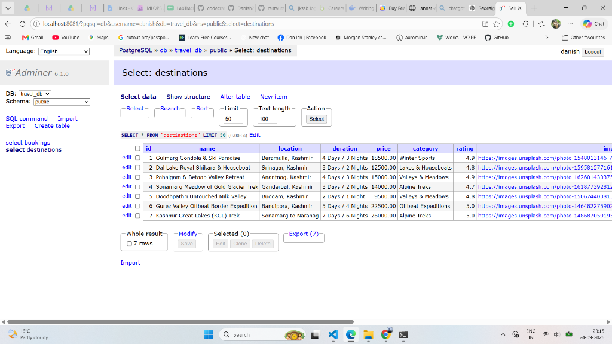
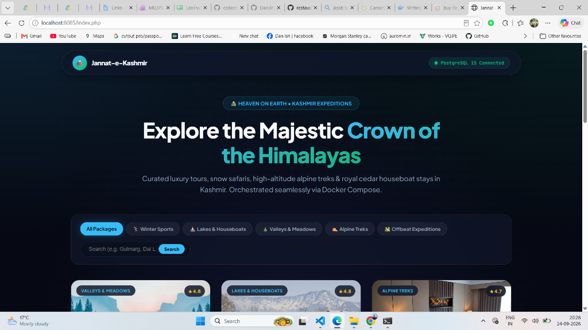

# Lab 66: Travel Packages Listing Application (Docker Compose, PostgreSQL & Adminer)

## 📌 Lab Overview & Production Architecture

In **Lab 66**, we engineered a production-grade multi-tier web application architecture orchestrating an **Apache + PHP 8.2** web application, a **PostgreSQL 15** relational database, and an **Adminer** database management interface using **Docker Compose**. 

While the classroom benchmark covered a restaurant listings app, we engineered an authentic **Kashmir Travel Packages & Reservation Platform** ("Jannat-e-Kashmir") featuring authentic destinations (Gulmarg, Dal Lake, Pahalgam, Sonamarg, Doodhpathri, Gurez Valley, and KGL Trek) coupled with an interactive relational booking engine and a visual database administration console.

This lab operationalizes five core industry DevOps patterns:
1. **The Twelve-Factor App Methodology**: Decoupling secrets and credentials into `.env` (strictly ignored by `.gitignore`) while providing a clean `.env.example` as a public specification.
2. **Automated Database Seeding**: Mounting an initialization schema (`./db/init.sql`) into `/docker-entrypoint-initdb.d/init.sql` so PostgreSQL automatically initializes tables and seed data upon first startup.
3. **Container Healthchecks & Dependency Ordering**: Employing `pg_isready` health probes with a defined `start_period` so dependent services (`travel-web` and `travel-adminer`) wait until the database is 100% healthy before accepting traffic.
4. **Visual Database Management (Adminer)**: Deploying a dedicated Adminer container on port `8081` communicating via container networking to facilitate database inspection, querying, and maintenance without CLI dependency.
5. **Live Hot-Reloading via Bind Mounts**: Mounting `./src:/var/www/html` so developers can modify PHP/HTML code with instant browser reflection without container rebuilds.

---

## 🏗️ Multi-Container Architecture Diagram

```text
                           [ Client Browser / User ]
                                 │            │
                    Port 8085 : 80            Port 8081 : 8080
                                 │            │
                                 ▼            ▼
┌────────────────────────────────────────────────────────────────────────────────────────┐
│  Docker Compose Project: travel-app-compose                                            │
│                                                                                        │
│  ┌────────────────────────────────────────┐  depends_on (healthy)  ┌─────────────────┐ │
│  │ Service: travel-web                    │ ─────────────────────> │ Service: travel-db│
│  │ Container: travel-web-service          │                        │ Container: db-… │ │
│  │ Image: custom built via Dockerfile     │                        │ Image: pg:15-…  │ │
│  │ Ports: 8085:80                         │                        │ Ports: 5432     │ │
│  │ Volumes: ./src -> /var/www/html (Bind) │                        │ Health: isready │ │
│  └───────────────────┬────────────────────┘                        └────────┬────────┘ │
│                      │                                                      ▲          │
│                      │                       ┌──────────────────────────────┘          │
│                      │                       │ depends_on (healthy)                    │
│                      │     ┌─────────────────┴───────────────────────┐                 │
│                      │     │ Service: travel-adminer                 │                 │
│                      │     │ Container: travel-adminer-service       │                 │
│                      │     │ Image: adminer:latest                   │                 │
│                      │     │ Ports: 8081:8080                        │                 │
│                      │     └─────────────────┬───────────────────────┘                 │
│                      │                       │                                         │
│                      └───────────────────────┼───────────────────────┐                 │
│                                              ▼                       │                 │
│                      ┌───────────────────────────────────────────────┴─────┐           │
│                      │ Network: travel-network (Isolated Bridge)           │           │
│                      │ Internal DNS: resolve 'travel-db'                   │           │
│                      └───────────────────────┬─────────────────────────────┘           │
│                                              │                                         │
│                                              ▼                                         │
│                                   ┌─────────────────────┐                              │
│                                   │ Volume: travel_pg…  │                              │
│                                   │ Path: /var/lib/pg…  │                              │
│                                   └─────────────────────┘                              │
└────────────────────────────────────────────────────────────────────────────────────────┘
```

---

## 🗂️ Project Directory Structure

```text
travel-app-compose/
├── .github/
│   ├── ISSUE_TEMPLATE/
│   │   ├── bug_report.md
│   │   └── feature_request.md
│   └── workflows/
│       └── ci.yml
├── assets/
│   └── app-preview.png                  # Application UI showcase asset
├── db/
│   └── init.sql                         # Database schema & initial seed data
├── src/
│   └── index.php                        # Responsive full-stack travel booking application
├── .env                                 # Local secrets (ignored by Git)
├── .env.example                         # Safe public environment template
├── .gitignore                           # Git exclusion rules
├── Dockerfile                           # Custom PHP 8.2 + Apache + PostgreSQL PDO drivers
├── docker-compose.yml                   # Multi-service declarative orchestration file
├── 66-travel-packages-listing-app.md    # Lab 66 documentation & verification log
├── CONTRIBUTING.md                      # Contribution guidelines
├── CODE_OF_CONDUCT.md                  # Community code of conduct
├── LICENSE                              # MIT License
└── README.md                            # Repository landing page
```

---

## 📝 Step-by-Step Implementation

### Step 1: Environment Decoupling (`.env` and `.env.example`)

We extracted configuration out of code into environment variables:

```ini
HOST_PORT=8085
ADMINER_PORT=8081
DB_HOST=travel-db
DB_PORT=5432
POSTGRES_DB=travel_db
POSTGRES_USER=danish
POSTGRES_PASSWORD=your_secure_password_here
```

The `.gitignore` strictly protects `.env`:
```text
.env
.env.*
!.env.example
*.log
pgdata/
.DS_Store
Thumbs.db
```

---

### Step 2: Database Schema & Seed Data (`db/init.sql`)

PostgreSQL automatically executes any SQL scripts placed inside `/docker-entrypoint-initdb.d/`:

```sql
CREATE TABLE IF NOT EXISTS destinations (
    id SERIAL PRIMARY KEY,
    title VARCHAR(150) NOT NULL,
    category VARCHAR(50) NOT NULL,
    location VARCHAR(100) NOT NULL,
    duration VARCHAR(50) NOT NULL,
    price NUMERIC(10, 2) NOT NULL,
    image_url TEXT NOT NULL,
    description TEXT NOT NULL,
    highlights TEXT[] NOT NULL,
    featured BOOLEAN DEFAULT FALSE,
    created_at TIMESTAMP WITH TIME ZONE DEFAULT CURRENT_TIMESTAMP
);

CREATE TABLE IF NOT EXISTS bookings (
    id SERIAL PRIMARY KEY,
    destination_id INT REFERENCES destinations(id) ON DELETE CASCADE,
    customer_name VARCHAR(100) NOT NULL,
    email VARCHAR(150) NOT NULL,
    phone VARCHAR(30) NOT NULL,
    travel_date DATE NOT NULL,
    num_travelers INT NOT NULL CHECK (num_travelers > 0),
    status VARCHAR(30) DEFAULT 'Confirmed',
    created_at TIMESTAMP WITH TIME ZONE DEFAULT CURRENT_TIMESTAMP
);
```

Initial seed data includes authentic Kashmir journeys:
- **Gulmarg Gondola & Ski Paradise** (₹18,500)
- **Dal Lake Luxury Houseboat & Shikara** (₹12,000)
- **Pahalgam Valley of Shepherds & Betaab Valley** (₹15,000)
- **Sonamarg Meadow of Gold & Thajiwas Glacier** (₹14,500)
- **Doodhpathri Valley of Milk Alpine Meadows** (₹11,000)
- **Gurez Valley & Habba Khatoon Peak Expedition** (₹22,500)
- **Kashmir Great Lakes High Altitude Alpine Trek** (₹26,000)

---

### Step 3: Custom Web Image Definition (`Dockerfile`)

We authored a production `Dockerfile` installing PostgreSQL client libraries into official PHP 8.2 Apache:

```dockerfile
FROM php:8.2-apache

# Install PostgreSQL client development libraries and compile PHP PDO drivers
RUN apt-get update && apt-get install -y --no-install-recommends \
    libpq-dev \
    && docker-php-ext-install pdo pdo_pgsql pgsql \
    && apt-get clean \
    && rm -rf /var/lib/apt/lists/*

EXPOSE 80

COPY ./src /var/www/html

RUN chown -R www-data:www-data /var/www/html \
    && chmod -R 755 /var/www/html
```

---

### Step 4: Multi-Service Orchestration (`docker-compose.yml`)

```yaml
services:
  travel-web:
    build:
      context: .
      dockerfile: Dockerfile
    container_name: travel-web-service
    ports:
      - "${HOST_PORT:-8085}:80"
    environment:
      DB_HOST: ${DB_HOST:-travel-db}
      DB_PORT: ${DB_PORT:-5432}
      POSTGRES_DB: ${POSTGRES_DB}
      POSTGRES_USER: ${POSTGRES_USER}
      POSTGRES_PASSWORD: ${POSTGRES_PASSWORD}
    volumes:
      - ./src:/var/www/html
    networks:
      - travel-network
    depends_on:
      travel-db:
        condition: service_healthy
    restart: unless-stopped

  travel-db:
    image: postgres:15-alpine
    container_name: travel-db-service
    environment:
      POSTGRES_DB: ${POSTGRES_DB}
      POSTGRES_USER: ${POSTGRES_USER}
      POSTGRES_PASSWORD: ${POSTGRES_PASSWORD}
    volumes:
      - travel_pgdata:/var/lib/postgresql/data
      - ./db/init.sql:/docker-entrypoint-initdb.d/init.sql
    networks:
      - travel-network
    healthcheck:
      test: ["CMD-SHELL", "pg_isready -U ${POSTGRES_USER} -d ${POSTGRES_DB}"]
      interval: 5s
      timeout: 5s
      retries: 10
      start_period: 10s
    restart: always

  travel-adminer:
    image: adminer:latest
    container_name: travel-adminer-service
    ports:
      - "${ADMINER_PORT:-8081}:8080"
    networks:
      - travel-network
    depends_on:
      travel-db:
        condition: service_healthy
    restart: unless-stopped

volumes:
  travel_pgdata:
    driver: local

networks:
  travel-network:
    driver: bridge
```

---

### Step 5: Stack Launch & Verification

```bash
docker compose up -d
docker compose ps
```

**Terminal Output:**
```text
NAME                     IMAGE                           COMMAND                  SERVICE          STATUS                 PORTS
travel-db-service        postgres:15-alpine              "docker-entrypoint.s…"   travel-db        Up (healthy)           5432/tcp
travel-web-service       travel-app-compose-travel-web   "docker-php-entrypoi…"   travel-web       Up                     0.0.0.0:8085->80/tcp
travel-adminer-service   adminer:latest                  "entrypoint.sh docke…"   travel-adminer   Up                     0.0.0.0:8081->8080/tcp
```

**HTTP Verification:**
```bash
curl -I http://localhost:8085
curl -I http://localhost:8081
```

---

## ⚡ Live Database Interactivity & Hot-Reloading Demo

### 1. Database Query Verification
```bash
docker compose exec travel-db psql -U danish -d travel_db -c "
SELECT id, title, price, duration FROM destinations LIMIT 3;
"
```

```text
 id |                   title                    |  price   | duration 
----+--------------------------------------------+----------+----------
  1 | Gulmarg Gondola & Ski Paradise             | 18500.00 | 4 Days / 3 Nights
  2 | Dal Lake Luxury Houseboat & Shikara        | 12000.00 | 3 Days / 2 Nights
  3 | Pahalgam Valley of Shepherds & Betaab Val… | 15000.00 | 4 Days / 3 Nights
(3 rows)
```

### 2. Adminer Database Management GUI Access
Navigating to `http://localhost:8081`:
- **System**: PostgreSQL
- **Server**: `travel-db`
- **Username**: `${POSTGRES_USER}` *(from `.env`)*
- **Password**: `${POSTGRES_PASSWORD}` *(from `.env`)*
- **Database**: `${POSTGRES_DB}` *(from `.env`)*

Enables visual management of records, schema inspection, and live SQL execution:


*Live visual inspection of the `destinations` table in Adminer connected to PostgreSQL 15 over `travel-network`.*

### 3. Application UI Showcase


*Live interactive Kashmir Travel booking experience orchestrated with Docker Compose and Apache/PHP 8.2.*

---

## 💡 Key DevOps Takeaways

1. **Deterministic Boot Sequencing**: Using `depends_on` alone only waits for the database container to create a process, not for the database engine to finish initializing. Pairing `depends_on` with `condition: service_healthy` and `pg_isready` eliminates container race conditions for all consuming services (`travel-web` and `travel-adminer`).
2. **Web-Based Database Observability**: Adminer acts as a lightweight, zero-configuration database administration tool that connects securely over the private Docker bridge network without exposing PostgreSQL port 5432 to the public internet.
3. **Environment Portability**: By using `.env` for all port mappings and credentials, the entire stack can be relocated to different ports or cloud hosts without modifying a single line of Compose configuration.
4. **Hot-Reloading with Data Persistence**: Bind mounts for source code enable immediate developer feedback loops, while named Docker volumes (`travel_pgdata`) protect PostgreSQL data across container destructions.
